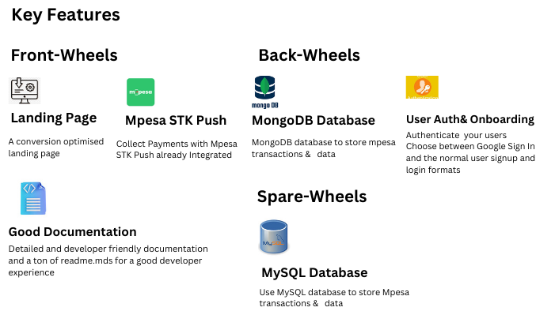
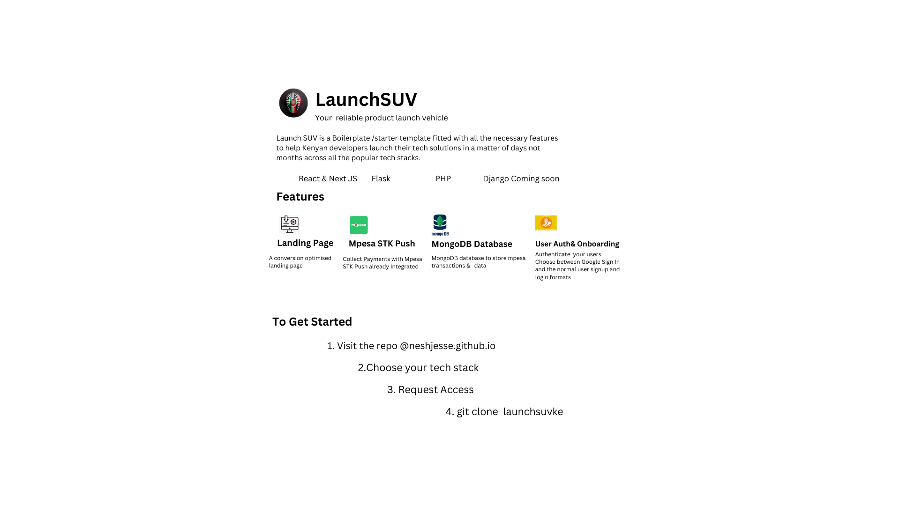

LaunchSUV  BOILERPLATE

Launch your solution as fast as possible
The Boilerplate with all the necessary features a Kenyan developer needs to launch their side projects and commercial solutions

## FOR FLASK DEVELOPERS
https://github.com/NeshJesse/flask-suv

## FOR REACT DEVELOPERS
https://github.com/NeshJesse/reactjs-suv

## Features and Steps
1. Front-Wheels
    * Landing Page
    * Mpesa STK Push
2. Back-Wheels
    * MongoDB Database
    * User Authentication
3. Spare-Wheels
    * MySQL Database
  
      
## CLONE
## FORK
## CONTRIBUTE

## FOLLOW ME ON GITHUB
## STAR THIS REPO
 * Whatsapp me +254 702337041
 * email @ neshjesse@gmail.com
 * twitter https://x.com/itsjessenesh

ALL A DEVELOPER NEEDS TO LAUNCH ANY COMMERCIAL SIDE PROJECT
Supportes tech stacks
FLASK
React Js & Next Js

STAR THIS REPO
FOLLOW ME ON GITHUB
Whatsapp me +254 702337041
email @ neshjesse@gmail.com
twitter @itsjesse.nesh
